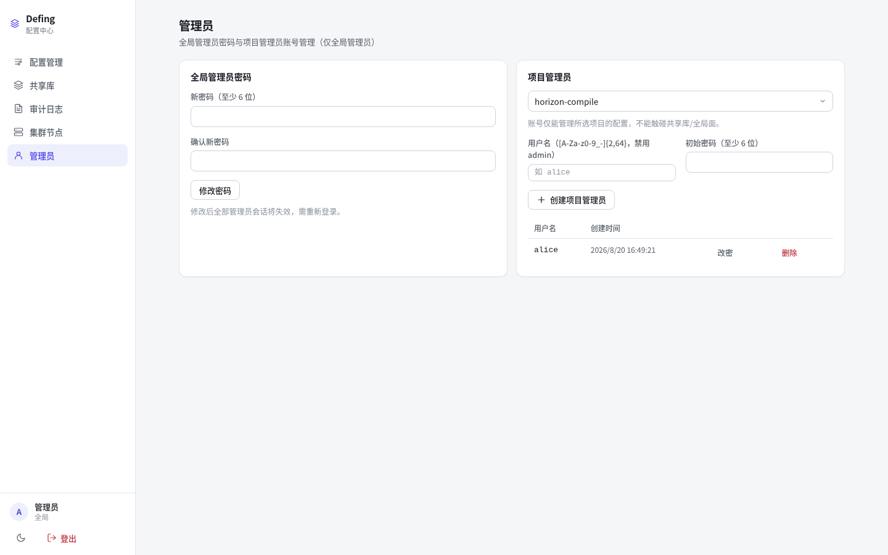
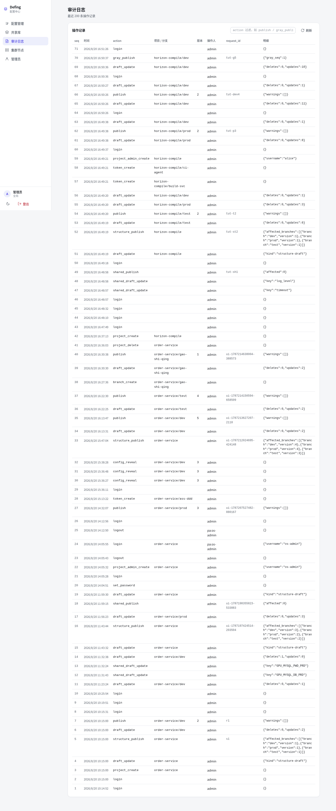

# 09 管理员与审计

## 9.1 管理员视图

左侧导航「管理员」（仅全局管理员可见）：

包含两块：

| 功能 | 说明 |
|---|---|
| 全局管理员密码 | 修改后全部管理员会话失效，需重新登录 |
| 项目管理员账号 | 为指定项目创建账号（如 `alice`），该账号只能管理**所属项目**的配置 |

### 项目管理员（PA）

- 一个账号绑定一个项目；一个项目可有多个账号
- PA 可登录 Admin UI 管理**自己项目**的草稿 / 结构 / 发布 / 灰度 / 版本，**不能**触碰共享库、集群、其他项目、账号管理
- 全局管理员可对 PA 账号「改密 / 删除」（删除后其会话立即失效）

## 9.2 审计日志

左侧导航「审计日志」：

记录全部管理面操作：

| 字段 | 说明 |
|---|---|
| 时间 | 操作时间 |
| 操作人 | `admin`（全局）/ `pa:alice`（项目管理员） |
| 动作 | login / project_create / structure_publish / publish / gray_publish / token_create / config_reveal 等 |
| 项目 / 分支 | 操作对象 |
| 详情 | 请求 ID 等 |

支持按动作类型过滤（如只看 `gray_publish`）。**reveal 明文查看配置**会记录 `config_reveal` 审计 —— 谁解密看过什么都有据可查。

## 9.3 集群节点

「集群节点」视图展示 Raft 集群成员（node id、gRPC/HTTP 地址、leader / voter 状态、提交日志序号）：

- `--dev-single` 单节点模式无集群成员
- 集群模式（[01 §1.3](01-install/)）下可查看成员，供 SDK 配置端点池
- 项目管理员可只读查看节点端点（用于配置 SDK 连接）；join / promote / remove 等管理操作仍仅限全局管理员

## 结语

至此你已走完 Defing 的核心使用流程：**部署 → 项目/分支 → 结构 → 草稿发布 → 灰度 → 共享库 → 令牌/SDK → 构建脚本 → 管理审计**。

更多细节可参考仓库 `docs/` 下的设计与部署文档。
