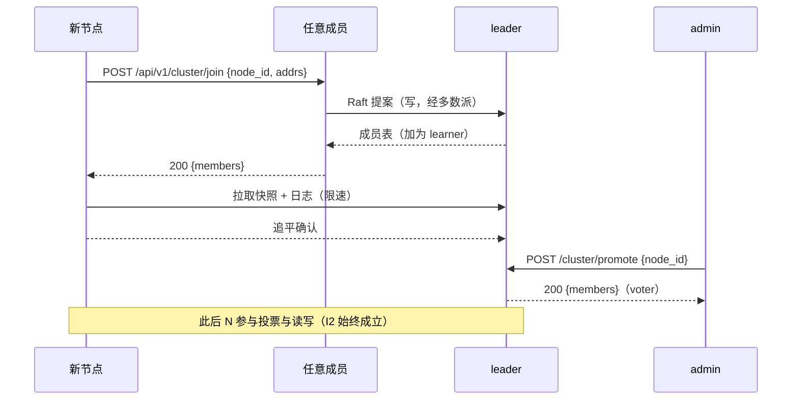
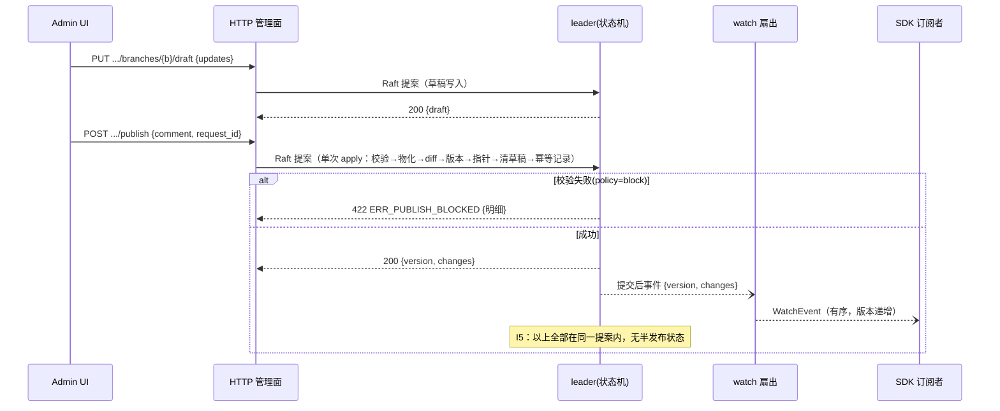
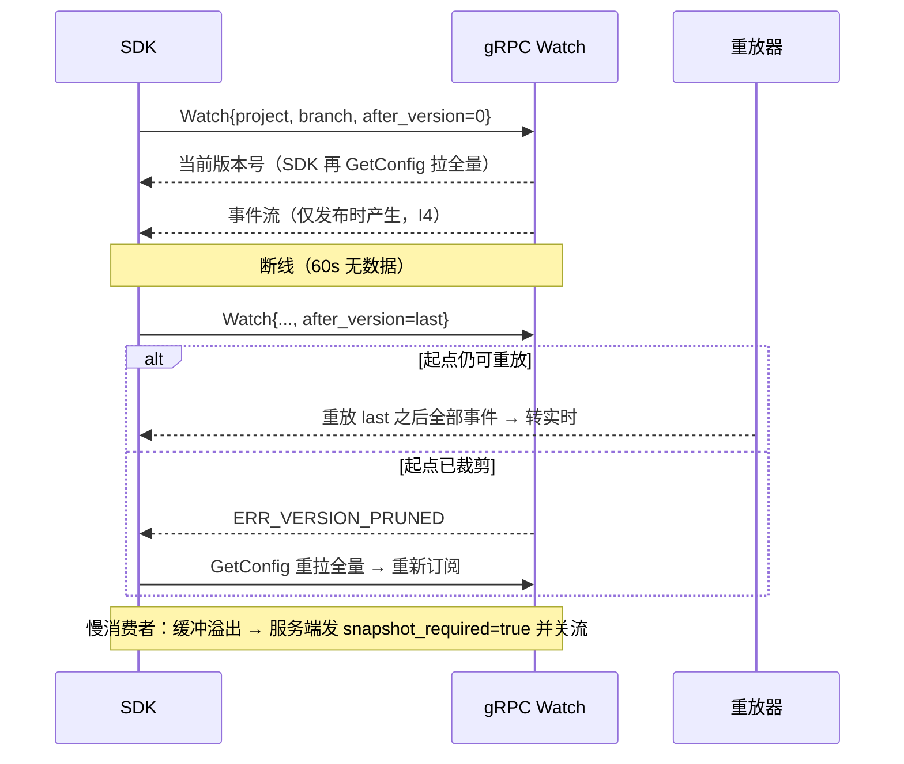
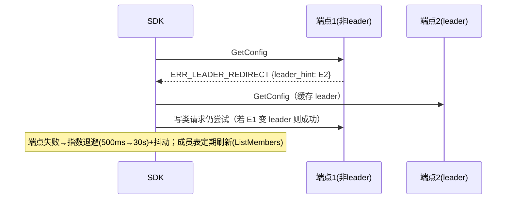
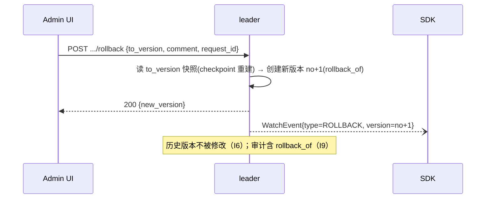
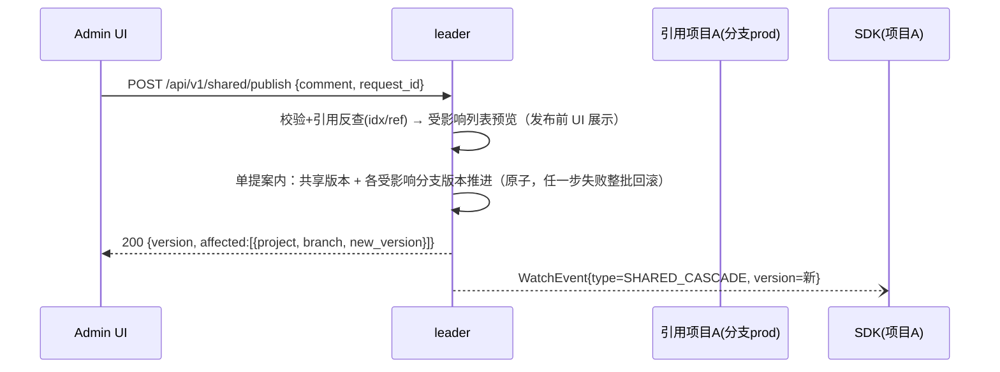
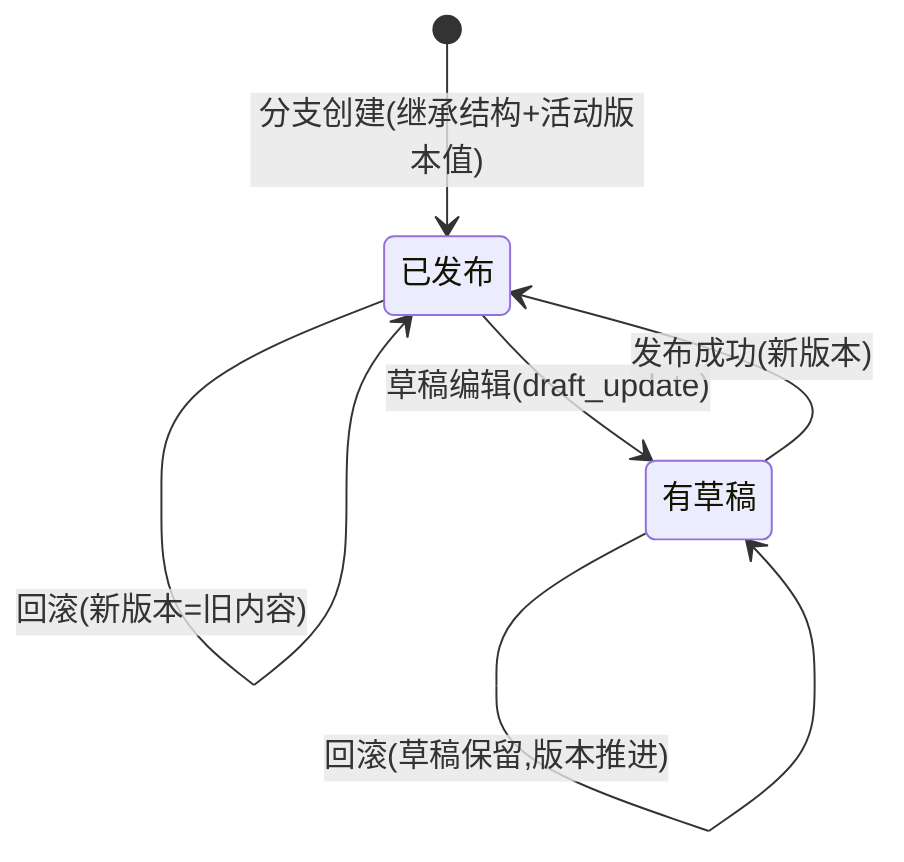
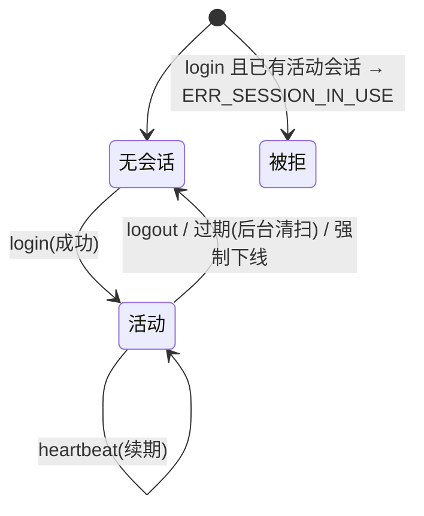

# 分布式配置文档服务 —— 设计细化推进 v3.0

> 依据：[docs/design-v2.md](./design-v2.md)（v2.0 审核修订版）§15 M0 检查清单与 §7 建议
> 版本：v3.0 ｜ 状态：评审稿
> 本版交付：① 管理面正式契约 [api/openapi.v1.yaml](../api/openapi.v1.yaml)；
> ② 存储工件 Schema [schema/storage.v1.schema.json](../schema/storage.v1.schema.json)；
> ③ 关键时序（Mermaid）、三语言 SDK 签名、状态机转移、具名测试用例、CLI 参考、
> 错误码/重试矩阵、M0 验收映射

---

## 1. 本版交付物与范围

| 交付物 | 内容 | 对应设计章节 |
|--------|------|-------------|
| api/openapi.v1.yaml | 管理面 REST 契约（25+ 路径、Schema、错误响应） | v2 §5.3/§5.4 |
| schema/storage.v1.schema.json | 状态机持久化工件 JSON Schema（$defs 定义库） | v2 §3 |
| 本文档 §2–§8 | 时序/签名/状态机/测试/CLI/验收 | v2 §4/§6/§10/§15 |

## 2. 关键时序（实现依据，标注不变量）

### 2.1 集群加入（I1/I2）


### 2.2 发布（I4/I5/I10）


### 2.3 watch 生命周期（I4，含断线续传与慢消费者）


### 2.4 SDK failover（R3）


### 2.5 回滚（I6/I9）


### 2.6 共享库发布与级联（auto，D7/D15）


## 3. SDK 三语言 API 签名（对齐 proto/config.v1.proto）

### 3.1 TypeScript（浏览器 + Node 双运行时）
```ts
type Endpoint = { grpc?: string; http?: string };
type Value = { type: 'string'|'int'|'float'|'bool'|'json'|'array'|'secret';
  strValue?: string; intValue?: number; floatValue?: number; boolValue?: boolean;
  jsonValue?: string; listValue?: string[]; masked?: boolean };
type Change = { group: string; key: string; kind: 'upsert'|'delete'; newValue?: Value };
type WatchEvent = { version: number; type: 'value_publish'|'structure_publish'|'shared_cascade'|'rollback';
  structureVersion: number; comment: string; changes: Change[]; snapshotRequired?: boolean };
type Snapshot = { project: string; branch: string; version: number;
  structureVersion: number; groups: Record<string, Record<string, Value>> };

class ConfigClient {
  constructor(endpoints: Endpoint[], opts?: { tls?: boolean; token?: string });
  get(project: string, branch: string, version?: number): Promise<Snapshot>;
  getItem(project: string, branch: string, group: string, key: string): Promise<Value>;
  watch(project: string, branch: string, listener: (e: WatchEvent) => void): Promise<() => void>;
  listMembers(): Promise<Member[]>;
  close(): void;
}
```
错误：`ConfigError { code: string; message: string; leaderHint?: string }`；自动 failover 与
leader 跟随在客户端内部完成，listener 不感知。

### 3.2 Go
```go
type Client struct { /* 内部：端点池、leader 缓存、本地缓存、watch 表 */ }
type Value struct { Type ValueType; Str *string; Int *int64; Flt *float64; Bool *bool;
  JSON *string; List []string; Masked bool }
type Change struct { Group, Key string; Kind ChangeKind; NewValue *Value }
type WatchEvent struct { Version int64; Type EventType; StructureVersion int64;
  Comment string; Changes []Change; SnapshotRequired bool }
type Snapshot struct { Project, Branch string; Version, StructureVersion int64;
  Groups map[string]map[string]Value }

func New(endpoints []string, opts ...Option) (*Client, error)
func (c *Client) Get(ctx context.Context, project, branch string, version int64) (*Snapshot, error)
func (c *Client) GetItem(ctx context.Context, project, branch, group, key string) (*Value, error)
func (c *Client) Watch(ctx context.Context, project, branch string, listener func(WatchEvent)) error // 阻塞直至 ctx 取消
func (c *Client) Close() error
```
内部：goroutine 扇出、context 贯穿、`sync.RWMutex` 保护缓存；`Watch` 返回错误码
`ErrVersionPruned` 时调用方应重拉全量。

### 3.3 Python（async）
```python
from typing import AsyncIterator, Callable, Awaitable, Optional

class ConfigClient:
    def __init__(self, endpoints: list[str], *, tls: bool = False, token: Optional[str] = None): ...
    async def get(self, project: str, branch: str, version: int = 0) -> ConfigSnapshot: ...
    async def get_item(self, project: str, branch: str, group: str, key: str) -> Value: ...
    async def watch(self, project: str, branch: str,
                    listener: Callable[[WatchEvent], Awaitable[None]]) -> None: ...  # 阻塞直至取消
    async def list_members(self) -> list[Member]: ...
    async def close(self) -> None: ...

class ConfigError(Exception):
    code: str; message: str; leader_hint: Optional[str]
```
内部：grpc.aio 流、asyncio 任务扇出、线程安全本地缓存（asyncio 单线程 + 锁）。

## 4. 状态机状态转移

### 4.1 分支（值）状态


### 4.2 会话状态（I7）


### 4.3 发布事务错误路径枚举（apply_publish 的返回）
| 返回 | 触发 | 客户端处理 |
|------|------|-----------|
| OK(version) | 成功 / 幂等重复（同 request_id） | 展示版本号 |
| ERR_NO_DRAFT | 草稿为空 | 提示 |
| ERR_PUBLISH_BLOCKED | 校验失败且 policy=block | 展示明细 |
| ERR_VALIDATION | 引用解析失败 | 展示明细 |
| ERR_FORBIDDEN | 权限不足 | 提示 |

## 5. 具名测试用例清单（模块 → 用例 → 不变量，可直接转测试代码）

| 模块 | 用例 ID | 用例 | 不变量 |
|------|---------|------|--------|
| raft-node | RAFT-001 | 3 节点 kill leader 后多数派选举新 leader，写不中断 | I1/I2 |
| raft-node | RAFT-002 | 网络分区：少数派侧写被拒 | I2 |
| raft-node | RAFT-003 | 新节点 join→learner→追平→promote 全流程 | I1 |
| raft-node | RAFT-004 | 落后节点快照+日志追赶后数据一致 | I1 |
| core | CORE-001 | 结构草稿发布后所有分支结构恒等（含新增/删除 item） | I3 |
| core | CORE-002 | 新建分支继承结构+活动版本值 | I3 |
| core | CORE-003 | 草稿编辑期间 SDK GetConfig 不变 | I4 |
| publish | PUB-001 | 发布后版本号+1、活动指针推进、草稿清空 | I5 |
| publish | PUB-002 | 同 request_id 重复发布只生效一次（返回同版本） | I10 |
| publish | PUB-003 | 校验失败(policy=block)不产生版本 | — |
| publish | PUB-004 | 回滚=新版本(rollback_of)，历史不可变 | I6/I9 |
| publish | PUB-005 | 结构发布对全部分支版本同时推进 | I3/I5 |
| shared | SHR-001 | 共享发布 auto 级联：受影响分支版本推进+事件 | D7 |
| shared | SHR-002 | 级联中某分支校验失败 → 整批回滚（原子） | D15 |
| shared | SHR-003 | 引用环被拒绝发布 | — |
| watch | WCH-001 | 断线重连 after_version 续传不丢事件 | I4 |
| watch | WCH-002 | 慢消费者溢出 → snapshot_required + 关流 | — |
| watch | WCH-003 | 事件版本号严格递增、顺序一致 | — |
| crypto | CRY-001 | 磁盘/快照/备份无明文扫描 | I8 |
| crypto | CRY-002 | 主密钥轮换后旧数据仍可解密（DEK 重包） | I8 |
| crypto | CRY-003 | 脱敏：导出默认掩码，reveal 需审计 | — |
| render | RND-001 | 随机 IR → YAML/TOML/JSON 语义等价（属性测试） | — |
| sdk | SDK-001 | 三语言契约测试：failover/leader 重定向/watch 续传 | R3/R4 |
| sdk | SDK-002 | 幂等重试：网络超时后同 request_id 重发安全 | I10 |
| limit | LIM-001 | 超限额（值大小/订阅数/缓冲）返回 ERR_LIMIT_EXCEEDED | — |

## 6. CLI 参考（dsh）

```
dsh --bootstrap [flags]                     # 首节点
dsh --join http://host:8384 [flags]         # 加入集群
dsh admin gen-master-key                    # 生成主密钥并打印指引
dsh admin rotate-master-key                 # 轮换主密钥（触发 DEK 重包任务）
dsh admin force-logout                      # 强制下线当前管理员会话（I7 兜底）
dsh admin set-password                      # 重置管理员密码（旧会话失效）
dsh admin promote --node <id>               # learner → voter
dsh admin remove-node --node <id>           # 移除节点
dsh admin snapshot                          # 触发快照（备份用）
dsh admin version-retention-status          # 查看保留策略与待裁剪版本数
```

## 7. 错误码全表与 SDK 重试矩阵

| 错误码 | 数据面? | 管理面? | 重试? | 退避 | SDK/客户端处理 |
|--------|---------|---------|-------|------|----------------|
| ERR_LEADER_REDIRECT | ✔ | ✔ | 立即 | 无 | 跟随 leader_hint 并缓存 |
| ERR_NOT_FOUND | ✔ | ✔ | 否 | — | 上报 |
| ERR_VALIDATION | — | ✔ | 否 | — | 展示明细 |
| ERR_PUBLISH_BLOCKED | — | ✔ | 否 | — | 展示明细（改草稿后重发） |
| ERR_VERSION_PRUNED | ✔ | — | 否 | — | 重拉全量后重订阅 |
| ERR_SESSION_IN_USE | — | ✔ | 否 | — | 提示/强制下线 |
| ERR_SESSION_EXPIRED | — | ✔ | 否 | — | 重新登录 |
| ERR_FORBIDDEN | ✔ | ✔ | 否 | — | 上报 |
| ERR_CYCLE_REF | — | ✔ | 否 | — | 展示 |
| ERR_CONFLICT | — | ✔ | 否 | — | 刷新后重试 |
| ERR_NO_DRAFT | — | ✔ | 否 | — | 提示 |
| ERR_LIMIT_EXCEEDED | ✔ | ✔ | 有限（退避后） | 指数 | 上报 |
| 网络错误/超时 | ✔ | ✔ | ✔ | 500ms→30s+抖动 | 幂等键配合重发（管理面） |

## 8. M0 验收映射（契约 → 验收条目）

| 契约/工件 | M0 验收条目 |
|-----------|------------|
| proto/config.v1.proto | 通过 `buf lint`；消息/枚举/字段与 design-v2 §5 一致；错误码注释与 §7 表一致 |
| api/openapi.v1.yaml | 通过 `redocly lint` 或 `swagger-cli validate`；路径与 design-v2 §5.3 一致 |
| schema/storage.v1.schema.json | 通过 JSON Schema 校验器；$defs 覆盖 §3.1 全部实体 |
| 数据模型 | ER 与 KV 布局（design-v2 §3）评审通过，与 schema 对齐 |
| 决策记录 | §16（design-v2）D1–D16 逐项确认，M0 例会签字 |
| 不变量→测试映射 | design-v2 §18.2 + 本文档 §5 用例清单评审通过 |
| CI 脚手架 | 构建 + 契约 golden 测试骨架（proto/openapi/schema 三方 lint） |

## 9. 后续细化路线图（下一批设计工作）

1. **性能基准方法**：基准场景（10k 订阅、大文档 1MB、发布 1k/s）、工具（criterion + k6 + ghz）、
   目标指标落地为 CI 门槛。
2. **UI 线框**：分支编辑页/发布确认流/版本历史/回滚确认/共享库级联预览 的页面级设计。
3. **企业版边界细节**：RBAC 模型（分支级权限）、灰度发布（按节点/百分比放量）设计、KMS 集成接口。
4. **代码生成接入**：proto → Go/TS/Python 生成（buf + tonic-build）、openapi → TS 客户端。
5. **发布引擎单元测试骨架**：把 §5 PUB-001~005 写成测试代码（附 mock 状态机）。
